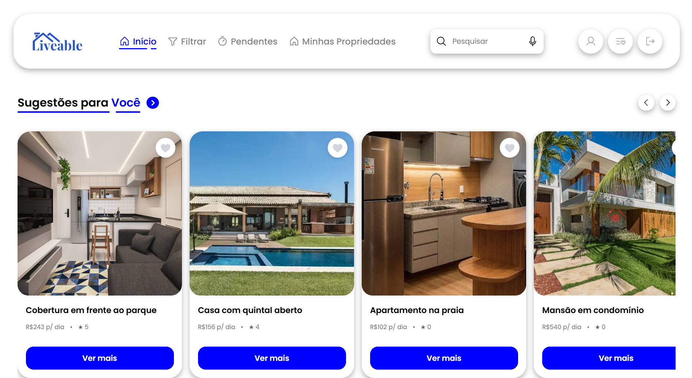
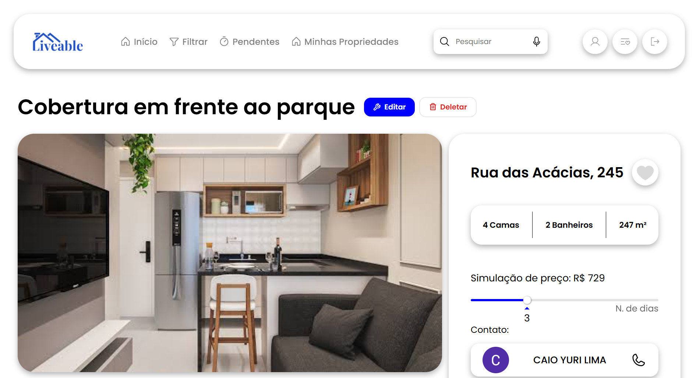
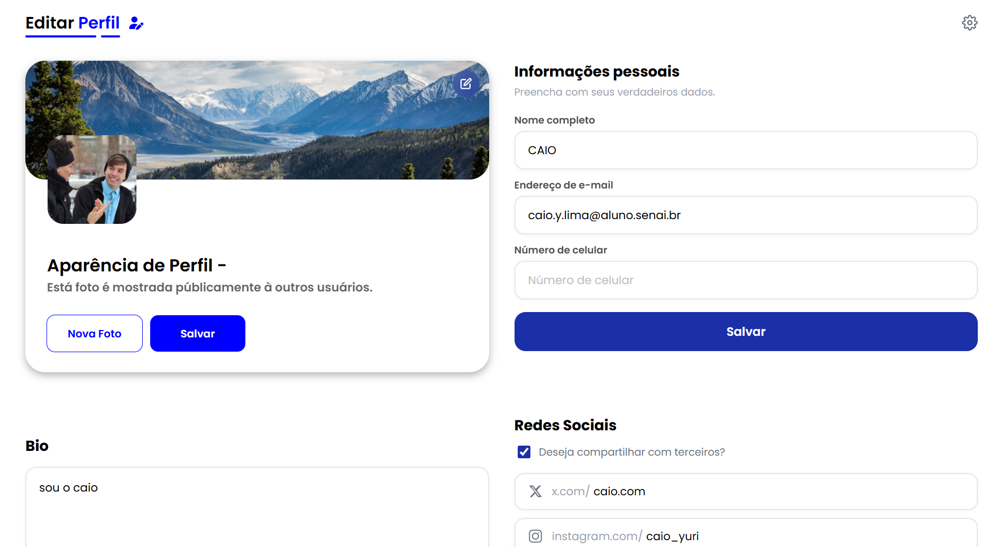

# Liveable

> Plataforma web para aluguel de imóveis, permitindo que usuários encontrem, anunciem e gerenciem propriedades de forma simples e intuitiva.

---

## Sobre o projeto

A **Liveable** é uma aplicação web desenvolvida com Vue.js e Laravel, criada com o objetivo de oferecer uma plataforma moderna para locação de imóveis.

O sistema permite que usuários cadastrem propriedades, pesquisem hospedagens, realizem reservas, favoritem imóveis e avaliem suas experiências por meio de uma interface responsiva e integrada a uma API REST.

---

## Demonstração

### Tela Inicial

<p align="center">
  
</p>

### Página de Detalhes

<p align="center">
  
</p>

### Perfil

<p align="center">
  
</p>

---

## Funcionalidades

- Cadastro de usuários
- Login e autenticação
- Cadastro de imóveis
- Edição e remoção de imóveis
- Upload de imagens
- Pesquisa de propriedades
- Favoritos
- Sistema de avaliações
- Visualização de informações detalhadas
- API REST
- Interface responsiva

---

## Tecnologias

### Front-end

- Vue 3
- TypeScript
- Vite
- Vue Router
- Pinia
- Axios
- Swiper
- Phosphor Icons

### Back-end

- Laravel
- PHP
- MySQL
- Laravel Sanctum

---

## Estrutura do projeto

```text
LIVEABLE-APP
│
├── liveable-backend
│   ├── app
│   ├── bootstrap
│   ├── config
│   ├── database
│   ├── public
│   ├── resources
│   ├── routes
│   ├── storage
│   ├── tests
│   ├── vendor
│   ├── .editorconfig
│   ├── .env
│   ├── .env.example
│   ├── .gitattributes
│   ├── .gitignore
│   ├── .npmrc
│   ├── artisan
│   ├── composer.json
│   ├── composer.lock
│   ├── package.json
│   └── phpunit.xml
│
├── liveable-frontend
│   ├── public
│   ├── src
│   ├── .editorconfig
│   ├── .gitattributes
│   ├── .gitignore
│   ├── .oxlintrc.json
│   ├── .prettierrc.json
│   ├── eslint.config.ts
│   ├── index.html
│   ├── package-lock.json
│   ├── package.json
│   ├── README.md
│   ├── tsconfig.app.json
│   ├── tsconfig.json
│   ├── tsconfig.node.json
│   └── vite.config.ts
│
├── ReadMePictures
│   ├── HomeLiveable.png
│   ├── DetailsLiveable.png
│   └── ProfileLiveable.png
│
└── README.md
```

---

## Como executar

### Clonar o repositório

```bash
git clone https://github.com/CaioYL10/liveable-app.git
```

Entre na pasta do projeto:

```bash
cd liveable-app
```

---

### Backend

Entre na pasta do backend:

```bash
cd liveable-backend
```

Instale as dependências:

```bash
composer install
```

Crie o arquivo de configuração:

```bash
cp .env.example .env
```

Gere a chave da aplicação:

```bash
php artisan key:generate
```

Crie o link simbólico para armazenamento:

```bash
php artisan storage:link
```

Execute as migrations:

```bash
php artisan migrate
```

Inicie o servidor:

```bash
php artisan serve
```

---

### Frontend

Abra outro terminal e entre na pasta do frontend:

```bash
cd liveable-frontend
```

Instale as dependências:

```bash
npm install
```

Inicie o servidor de desenvolvimento:

```bash
npm run dev
```

---

## API

Exemplos de rotas disponíveis:

```http
GET    /api/properties
GET    /api/properties/{id}

POST   /api/login
POST   /api/register

POST   /api/review
POST   /api/favorite
```

---

## Arquitetura

```text
Vue 3
   │
Axios
   │
Laravel API
   │
MySQL
```
